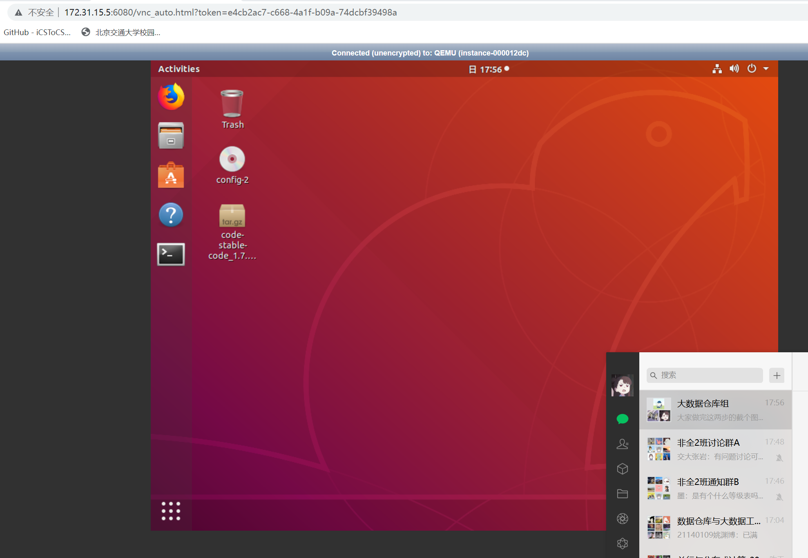

# 3.13

## 今日目标

今天先完成实验一的预置步骤：

1. 连上 libvpn

2. 安装/登录自己的虚拟机

## 背景资料

研究生云个人虚拟机使用说明-V2--2021.pdf

[arrayVPN 下载页](https://client.arraynetworks.com.cn:8080/zh/troubleshooting)

bjtu linux 虚拟机 默认密码 123456

## 今日结果

yyh

zzf

gtx

